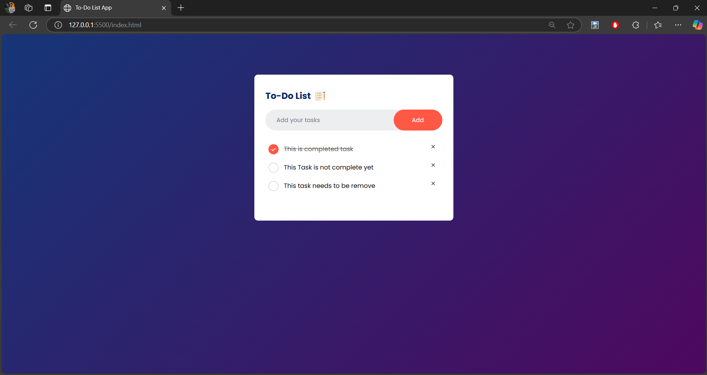

# To-Do List App

A simple **To-Do List App** built with HTML, CSS, and JavaScript. This app allows users to add tasks, mark them as completed, and delete them. It also uses `localStorage` to persist tasks between page refreshes.

## Features

- ✅ Add tasks by clicking the **Add** button or pressing **Enter**.
- ✅ Mark tasks as **completed** (strikes through text).
- ✅ Delete tasks by clicking the **×** button.
- ✅ Data is stored using **localStorage** to persist tasks even after a page refresh.
- ✅ Simple, responsive UI with a clean design.

## Preview



## Project Structure

todo-list-app/
├── images/                # Folder containing images for checked and unchecked icons
│    ├── checked.png       # Icon for completed task
│    └── unchecked.png     # Icon for incomplete task
├── index.html             # Main HTML file containing the structure of the app
├── style.css              # CSS file for styling the app
├── script.js              # JavaScript file for the app's logic and functionality
└── README.md              # Project documentation file


## Installation

1. Clone the repository to your local machine:

   ```bash
   git clone https://github.com/your-username/todo-list-app.git
   cd todo-list-app
